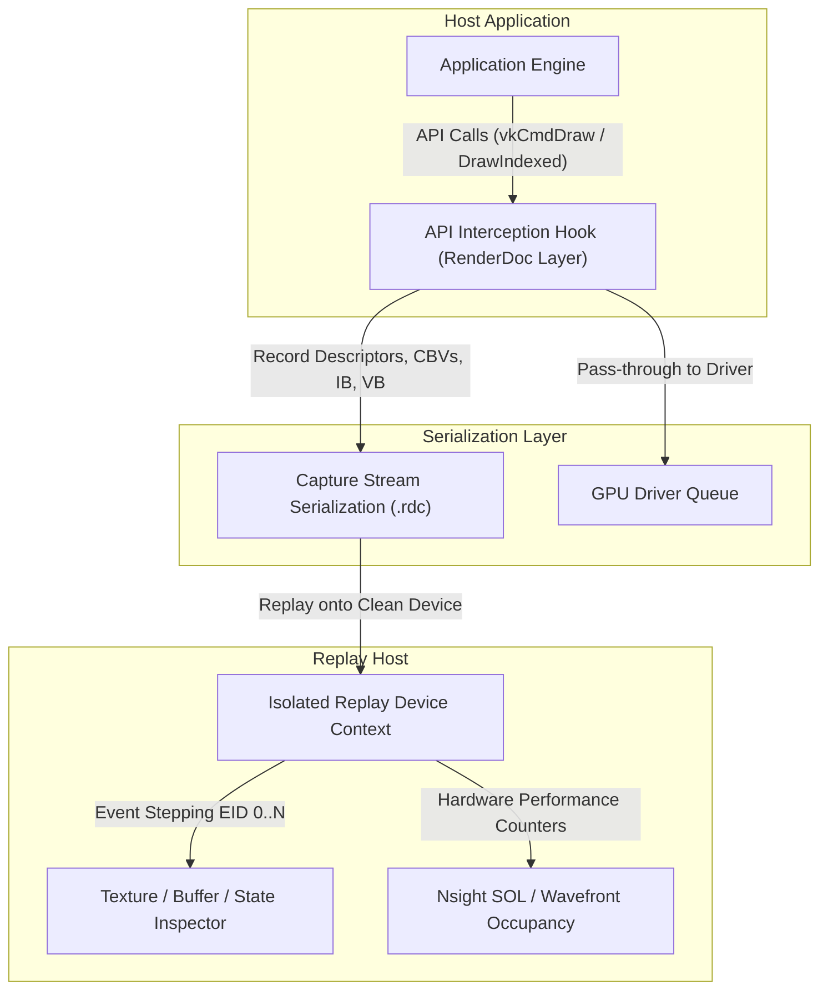

# Module 13: RenderDoc & Nsight Frame Dissection: Step-by-Step Anatomy of a Complete 3D Frame

---

## 1. Introduction: How GPU Debuggers Capture and Dissect Frames

Modern graphics APIs (DirectX 12, Vulkan, Metal) decouple the CPU timeline from the GPU queue execution. Unlike CPU debuggers that pause thread execution using hardware breakpoints (`INT 3`), a GPU debugger such as **RenderDoc**, **NVIDIA Nsight Graphics**, or **AMD Radeon Developer Tool Suite (RGP)** operates via API injection and command stream serialization.

When a capture is triggered (e.g., via `F12` or `PrintScreen`):
1. **API Interception Layer**: The debugger injects a custom Vulkan Validation Layer or DXGI Hook between the engine and the display driver.
2. **State Snapshot**: Every resource bound to the current frame—VertexBuffer, IndexBuffer, ConstantBuffer, Descriptor Heaps, and Samplers—is captured and serialized into a replay archive (`.rdc`).
3. **Hardware Replay**: The debugger boots a headless replay context on the target GPU and re-executes API commands deterministically event by event (Draw Call / Dispatch / Barrier).
4. **State Reflection**: For any arbitrary Event ID (EID), developers can inspect the exact contents of every Render Target texture, subresource memory layout, depth stencil attachment, and pipeline state.

---

## 2. The 9 Canonical Frame Events: From Clears to Presentation

A production-grade physically based rendering frame proceeds through 9 distinct phases:

```mermaid
flowchart LR
    E0["EID 0: Clears & Barriers"] --> E1["EID 1: Depth Pre-Pass"]
    E1 --> E2["EID 2: Shadow Mapping"]
    E2 --> E3["EID 3: G-Buffer Base Pass"]
    E3 --> E4["EID 4: Ambient Occlusion"]
    E4 --> E5["EID 5: SSR Reflections"]
    E5 --> E6["EID 6: Deferred Lighting"]
    E6 --> E7["EID 7: Anti-Aliasing"]
    E7 --> E8["EID 8: Tone Mapping & Present"]
```

### Event 0: Resource Transitions & Clears
- **API Call**: `vkCmdPipelineBarrier` / `ResourceBarrier(TRANSITION)`, followed by `vkCmdClearColorImage`, `vkCmdClearDepthStencilImage`.
- **Pipeline State**: No vertex/pixel shaders bound. Target attachments transition from `PRESENT` or `UNINITIALIZED` to `RENDER_TARGET` / `DEPTH_WRITE`.
- **Target Formats**:
  - Color Targets: `R8G8B8A8_UNORM` or `R11G11B10_FLOAT`, cleared to `(0, 0, 0, 0)`.
  - Depth Target: `D32_SFLOAT`, cleared to `0.0` (for Reverse-Z) or `1.0` (for Standard-Z).
  - Stencil Target: `S8_UINT`, cleared to `0x00`.

### Event 1: Early Depth Pre-Pass
- **API Call**: `vkCmdDrawIndexed` (Opaque Geometry).
- **Pipeline State**: 
  - Color Mask: `0x0` (Color write completely disabled).
  - Depth State: `DepthEnable = TRUE`, `DepthWriteMask = ALL`, `DepthFunc = GREATER` (Reverse-Z).
- **GPU Architectural Role**: Populates the **Z-Cull / Hi-Z tile metadata hierarchy**. Any subsequent heavy pixel shader evaluation will be skipped at the rasterizer level if occluded by closer geometry.

### Event 2: Shadow Map Generation
- **API Call**: `vkCmdDrawIndexed` from Light Frustum.
- **Pipeline State**:
  - Target: Shadow Depth Texture (`D16_UNORM` or `D32_SFLOAT`).
  - Depth Bias: Constant slope and depth bias enabled (`vkCmdSetDepthBias`) to eliminate shadow acne.
  - Viewport: Orthographic (Cascaded Shadow Maps) or Perspective (Spotlight / Perspective Shadow Maps).

### Event 3: G-Buffer Base Pass (Deferred Rasterization)
- **API Call**: Multiple Render Targets (MRT) `vkCmdDrawIndexed`.
- **Pipeline State**:
  - Depth State: `DepthWrite = FALSE`, `DepthFunc = EQUAL` (tests against Depth Pre-Pass, zero quad overdraw).
  - RT 0 (`R8G8B8A8_SRGB`): Albedo Color $[R, G, B]$ + Material Specular/Metallic $[A]$.
  - RT 1 (`R16G16_SNORM` or `R16G16B16A16_SFLOAT`): World/View Normal vector $[N_x, N_y, N_z]$ + Perceptual Roughness $[\alpha]$.
  - RT 2 (`R10G10B10A2_UNORM`): Material Occlusion $[R]$, Emission $[G, B]$.

### Event 4: Ambient Occlusion Computation
- **API Call**: Fullscreen Quad Draw or Compute Dispatch (`vkCmdDispatch`).
- **Input Resources**: Depth Texture (`D32_SFLOAT`), Normal Texture (`R16G16_SNORM`).
- **Primitive vs. Modern**:
  - **Primitive SSAO**: Samples sphere hemisphere in view space, noisy, high radius bleeding.
  - **Modern HBAO/GTAO**: Integrates horizon angles along multiple radial directions, respecting normal tangents without sphere self-occlusion.

### Event 5: Specular Reflections (SSR vs IBL Cubemap)
- **API Call**: Compute Dispatch or Screen-Space Quad Draw.
- **Input Resources**: G-Buffer Normals, Roughness, Depth, and previous frame scene color.
- **Raymarching**: Hierarchical Hi-Z 2.5D DDA marches rays across the depth buffer to find intersections with dynamic geometry. Fallback samples static prefiltered environment cubemaps for rays that miss or leave the frustum.

### Event 6: Deferred Lighting Integration
- **API Call**: Stencil volume light meshes or full-screen compute tile/cluster dispatch.
- **Shading Models**:
  - **Primitive (Blinn-Phong)**: $L_o = I \cdot [k_d (N \cdot L) + k_s (N \cdot H)^m]$.
  - **Modern (Cook-Torrance GGX)**: Microfacet distribution $D(\theta_h)$, shadowing-masking $G(\mathbf{l}, \mathbf{v})$, Fresnel-Schlick $F(\mathbf{v}, \mathbf{h})$.

### Event 7: Anti-Aliasing (Spatial vs Temporal)
- **API Call**: Fullscreen Post-Processing Pass.
- **Primitive Approach (MSAA)**: 2x/4x sample frequency coverage rasterization. Multiplies G-buffer bandwidth by $4\times$.
- **Intermediate Approach (FXAA)**: Post-process morphological edge detection on luminance gradients. Low cost (~0.4 ms), but introduces high-frequency texture blur.
- **Modern Approach (TAA)**: Subpixel camera jitter (Halton 2,3 sequence) accumulated across frames with motion vectors and neighborhood variance clipping in YCoCg color space.

### Event 8: HDR Post-Processing & Tone Mapping
- **API Call**: Post-process blit to swapchain format (`B8G8R8A8_SRGB`).
- **Operators**:
  - **Primitive Clamp**: `clamp(color, 0.0, 1.0)` produces harsh burnt whites.
  - **Intermediate Reinhard**: `color / (1.0 + color)` compresses highlights, desaturates chromaticity.
  - **Modern ACES Filmic**: S-shaped cinematic shoulder curve preserving chromatic saturation across high dynamic range specular glints.

---

## 3. Pipeline State Reflection: Reading the Hardware State

When inspecting a draw call in RenderDoc's **Pipeline State** viewer, four hardware units dictate how primitives are processed:

| Pipeline Stage | Critical Parameters | Architectural Impact |
| :--- | :--- | :--- |
| **Input Assembly (IA)** | `PrimitiveTopology = TRIANGLE_LIST`, Index Stride | Determines vertex reuse in Post-Transform Vertex Cache (PT-FIFO). |
| **Rasterizer (RS)** | `CullMode = BACK`, `FrontFace = CCW`, `ScissorEnable` | Early culling eliminates back-facing geometry before quad grouping. |
| **Depth/Stencil (DS)** | `DepthEnable`, `DepthWrite`, `DepthFunc = GREATER` | Controls Z-Cull tests and Hi-Z metadata hierarchical rejection. |
| **Output Merger (OM)** | `BlendEnable`, `SrcBlend = ONE`, `DestBlend = ONE` | ROP blending for additive lighting or G-buffer MRT write mask. |

---

## 4. Primitive vs Modern Paradigm Comparison

| Rendering Feature | Primitive Approach (Legacy 2005–2010) | Modern Approach (Current Production 2020+) | Benefit of Modern Approach |
| :--- | :--- | :--- | :--- |
| **Pipeline Architecture** | Standard Forward / Fat Deferred (128-bit MRT) | Visibility Buffer / Clustered Forward+ with Software Attribute Pulling | Reduces VRAM bandwidth by up to $60\%$, eliminates quad overdraw waste. |
| **Depth Precision** | Standard-Z: $[0.0 \to 1.0]$, IEEE 754 precision clustered at camera near plane | Reverse-Z: $[1.0 \to 0.0]$, float exponents mirror $1/z$ perspective distribution | Eliminates Z-fighting across massive open-world view distances. |
| **Shading Model** | Blinn-Phong empirical specular highlights | Cook-Torrance Microfacet PBR (GGX + Smith Height-Correlated $G2$ + Schlick) | Energy-conserving, physically plausible material responses across all lighting. |
| **Ambient Occlusion** | Screen-Space Ambient Occlusion (SSAO) with random hemisphere kernel | Ground Truth Ambient Occlusion (GTAO) or Horizon-Based AO (HBAO) with normal integration | Eliminates halo artifacts, reproduces contact shadows and corner darkness accurately. |
| **Specular Reflections**| Static Environment Cubemaps | Screen-Space Reflections (SSR) with Hi-Z raymarching + Split-Sum IBL fallback | Reflects dynamic scene objects and characters in real time. |
| **Anti-Aliasing** | 4x MSAA (expensive memory footprint) or FXAA (blurry textures) | TAA with Halton jitter, velocity reprojection, and YCoCg variance clipping | Crisp edge reconstruction, supersampled specular subpixel geometry stability. |
| **Tone Mapping** | Hard RGB Clamp or Reinhard luminance division | ACES Filmic S-curve (Narkowicz fit) with Rec. 709 gamut mapping | Cinematic shoulder roll-off, preserves color saturation in bright highlights. |

---

## 5. Summary & Hands-On Exploration

Use the interactive **RenderDoc / Nsight Frame Dissection Viewer** below to scrub through each frame event (Event 0 to Event 8), toggle individual G-Buffer channels (`RGB`, `R`, `G`, `B`, `Depth`, `Overdraw`), and compare legacy versus modern rendering techniques in real time.

