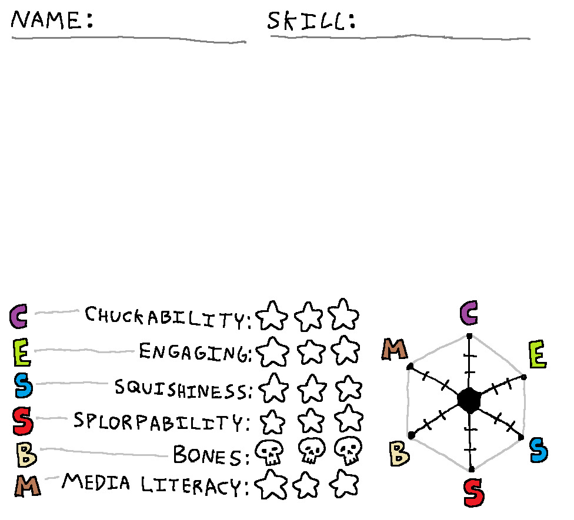

# silly blorbo character stat editor ✨

a cute, colorful, cartoony, and ms-paint-aesthetic character stat editor based on the blorbo template card, complete with an interactive spider chart!

## 🌟 features

- **character card header**:
  - editable `name:` and `skill:` fields styled like handwritten ink on wobbly paper lines.
  - "🎲 randomize!" button rolls random silly blorbo names, skills, and stats with a squishy card bounce.

- **ms-paint style doodle canvas**:
  - **drawing tools**: pen (`✏️`), eraser (`🧽`), upload image (`🖼️`), undo (`↩️`), and clear (`🗑️`).
  - **brush sizes**: fine (`s`), medium (`m`), chonky (`l`).
  - **palette**: classic doodle colors including black, red, orange, yellow, lime, sky blue, purple, pink, brown, and white.
  - **stamps**: click to stamp cute emojis onto your canvas (🌸 blush, ✨ sparkles, 💧 sweatdrop, 🔪 butter knife, 👑 crown, 🕶️ shades, ❤️ heart, 🎀 ribbon, 💤 zzz, 💢 anger).
  - **photo upload**: load any photo or drawing into the portrait frame and doodle right on top of it.

- **interactive stats (c-e-s-s-b-m)**:
  - `c` (purple) — **chuckability**: how easily you can throw them across the room.
  - `e` (lime green) — **engaging**: charisma and responsiveness.
  - `s` (sky blue) — **squishiness**: how soft and malleable they are.
  - `s` (bright red) — **splorpability**: how they flatten like slime upon impact.
  - `b` (bone beige) — **bones**: number of bones (0 to 3, rendered with custom cartoon skull icons 💀!).
  - `m` (warm brown) — **media literacy**: textual comprehension vs eating the physical book.
  - freestanding cartoon bubble letters with squash-and-stretch wobble on hover and click!
  - clickable stars (☆ / ★) and skulls that toggle 0 to 3 rating with spring-pop animations.

- **spring-animated spider / radar chart**:
  - pointy-top hexagon matching the original drawing layout (`c` on top, clockwise `e`, `s`, `s`, `b`, `m`).
  - solid black center hexagon with 3 tick marks along each spoke.
  - bouncy spring physics loop: the polygon smoothly wobbles into shape like jelly on every stat update!
  - rock-solid, smooth letter hover interaction with dedicated hitboxes.
  - drag points directly on the chart or click the letters to cycle stats.

- **sharing & exporting**:
  - 💾 **save png**: renders the complete card into a high-res, crisp image download.
  - 📋 **copy card**: copies the image directly to your clipboard to paste into discord, twitter, or chat!

## 🚀 how to run

simply double-click **`index.html`** in your browser (chrome, edge, firefox, safari) — no build steps or dependencies required!
